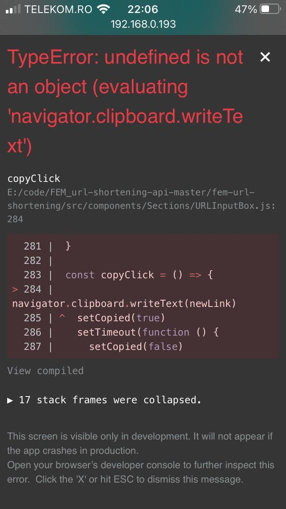

# Frontend Mentor - Shortly URL shortening API Challenge solution

This is a solution to the [Shortly URL shortening API Challenge challenge on Frontend Mentor](https://www.frontendmentor.io/challenges/url-shortening-api-landing-page-2ce3ob-G). Frontend Mentor challenges help you improve your coding skills by building realistic projects.

## Table of contents

- [Overview](#overview)
  - [The challenge](#the-challenge)
  - [Screenshot](#screenshot)
  - [Links](#links)
- [My process](#my-process)
  - [Built with](#built-with)
  - [What I learned](#what-i-learned)
  - [Continued development](#continued-development)
  - [Useful resources](#useful-resources)
- [Author](#author)

## Overview

In this challenge I continued practicing React and I also made myself comfortable with styled components.

### The challenge

Users should be able to:

- View the optimal layout for the site depending on their device's screen size
- Shorten any valid URL
- ~~See a list of their shortened links, even after refreshing the browser~~
- Copy the shortened link to their clipboard in a single click
- Receive an error message when the `form` is submitted if:
  - The `input` field is empty

### Screenshot


### Links

- Solution URL: [Frontend Mentor](https://your-solution-url.com)
- Live Site URL: [Netlify](https://shortly-fem.netlify.app/)

## My process

### Built with

- Semantic HTML5 markup
- CSS custom properties
- Flexbox
- Mobile-first workflow
- [React](https://reactjs.org/) - JS library
- [Styled Components](https://styled-components.com/) - For styles

### What I learned

I enjoy styled components a lot, having the styling close to the functionality makes developing components a breeze, not to mention sass integration! The following block of code was how I initially layed out the 'logo' component in the navbar.

From this:

```jsx
const Logo = () => {
  const logo = {
    fill: '#232127',
    width: '6em',
    height: '3em',
  }

  return (
    <svg className={logo}>
      <use href={sprite + '#logo'} />
    </svg>
  )
}
```

To this:

```jsx
const StyledLogo = styled.svg`
  fill: #232127;
  width: 6em;
  height: 3em;
`
const Logo = () => {
  return (
    <StyledLogo>
      <use href={sprite + '#logo'} />
    </StyledLogo>
  )
}
```

_No biggie, but it looks nicer._

- The :hover state on mobile' article I'm mentioning in the [Useful resources](#useful-resources) comes down to this fix:

```scss
&:active {
      background-color: hsl(257, 7%, 63%);
    }
    @media (hover: hover) and (pointer: fine) {
      &:hover {
        cursor: pointer;
        background-color: hsl(180, 72%, 80%);
        transition: background-color 300ms;
      }
      &:active {
        background-color: hsl(257, 7%, 63%);
      }
    }
  }
```

Using ` @media (hover: hover) and (pointer: fine)` to differentiate the touchscreen capable devices from ordinary computers. This prevents the button from being stuck with the hover effect when tapped and thus no confused user.

- I learned how to use `async` functions and how to manage api calls.
  In case of a bad request, the error code will go through a switch statement and the message displayed under input text will comply with the API <a href="https://shrtco.de/docs/">table</a> of errors.

- One aspect I had to tackle with was how will the inserted link get passed into the api call. Some users including myself feel more natural hitting the Enter button after pasting a link. At first I though about having an event listener on the document and on every keyboard input, it will be checked if 'Enter' was pressed, if it was, then the input text will be attached to the api method. However, I don't like the idea of monitoring every keystroke so I modified the input container from a `<div>` to a `<form>`. Now the button in the form would to the job but, when submitting a form the page reloads, so now `e.preventDefault()` is mandatory in the API call function.

- Ugly form buttons. `input[type='submit']` is unstylable so they have to be replaced with ordinary buttons.


- I also cleared the unrealistic errors, for example, error 3 regarding the rate limit will never be displayed because the user won't be able to send a second request until the button animation stops, which takes longer than one second.

#### Kept errors:

| error         |                                  meaning                                  |
| ------------- | :-----------------------------------------------------------------------: |
| error_code:2  |                           Invalid URL submitted                           |
| error_code:4  |   IP-Address has been blocked because of violating our terms of service   |
| error_code:6  |                               Unknown error                               |
| error_code:10 | Trying to shorten a disallowed Link. More information on disallowed links |

- The use of `navigator.clipboard.writeText(newLink)` throws an error when executed in development stage but works fine on the final build.



<hr/>

- <h2>  Image of the issue mentioned on Frontend Mentor </h2>


<hr/>
### Continued development

I didn't find a proper way to list all the links that were passed through. I did find some articles about functional components and got advice on slack but I still couldn't manage to get them to work. I believe I could've split the input section in smaller components and pass props in order to generate a component for each link, inside the section. After spending hours with this task I decided to find an alternative of showing the links and move on with the challenge, sitting too much on an issue would just not help as much as noting it down and doing some research afterwards.

Further, I want to continue using React on my following projects.
I also want to adopt <a href="https://www.a11yproject.com/">a11y</a> practices and make every site more accesible.

_Some of the stuff I wrote about seem trivial but writing them down while working helps me carry over to the next project all the stuff I learnt tackling the current one._

### Useful resources

- [solution to :hover on touchscreens](https://medium.com/@mezoistvan/finally-a-css-only-solution-to-hover-on-touchscreens-c498af39c31c) - This article guided me on how to deal with the problematic hover states on mobile.

## Author

- Frontend Mentor - [@popescudragos](https://www.frontendmentor.io/profile/popescudragos)
- LinkedIn - [@ospop](https://www.linkedin.com/in/ospop/)
